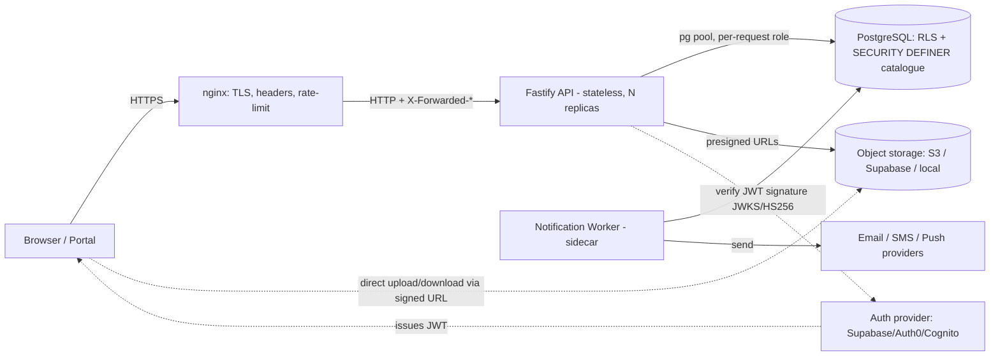
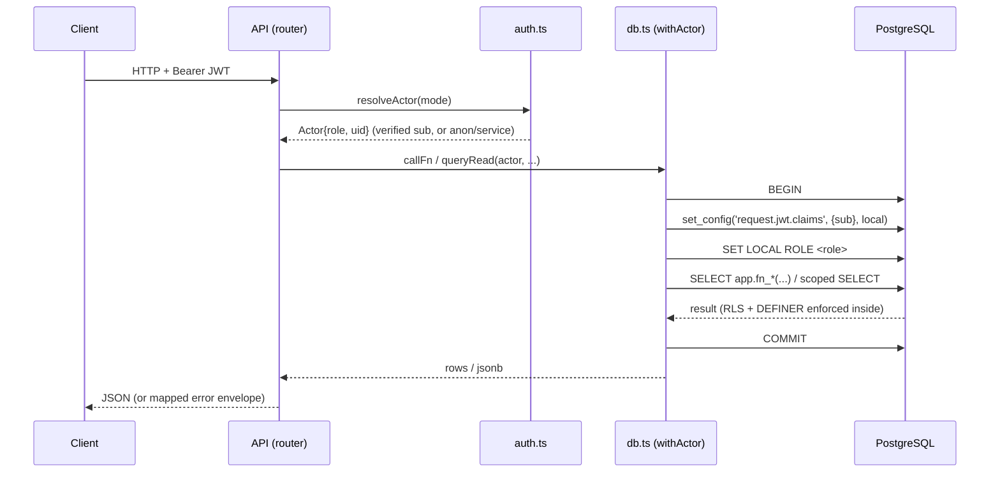

# SJKVY Backend — Architecture Documentation

Version 1.0. The PostgreSQL database is the authoritative business layer; the API and
worker are thin, stateless tiers over the verified function catalogue. This document is
the canonical architecture reference (diagrams in Mermaid).

## 1. System topology



- **Database:** 55 tables, 48 RLS policies, 90+ SECURITY DEFINER functions
  (migrations 0000–0005). Business logic, authorization, state machines, idempotency and
  concurrency all live here.
- **API:** verifies the caller's JWT, sets `request.jwt.claims` + `SET LOCAL ROLE` per
  transaction, then invokes a catalogue function or an RLS-scoped read. No ORM, no logic.
- **Worker:** drives the outbox/delivery functions as `service_role` (EXECUTE-only).
- **Storage/Auth/Providers:** external, integrated via drivers/adapters (env-selected).

## 2. Request → identity → enforcement



The single access path (`src/db.ts`) guarantees every DB interaction runs under the
caller's identity + role. The database — not the API — decides what is permitted.

## 3. Authentication flow

```mermaid
sequenceDiagram
  participant C as Client
  participant AP as Auth provider
  participant A as API
  participant PG as PostgreSQL
  C->>AP: sign in (OTP / password / SSO)
  AP-->>C: access token (JWT, sub = profile id)
  C->>A: request + Bearer JWT
  A->>A: jwtVerify (JWKS RS256/ES256 or HS256): sig, exp, iss, aud
  A->>A: reject role-escalation claims (role=service_role -> 403)
  A->>PG: set request.jwt.claims={sub}; SET LOCAL ROLE authenticated
  PG->>PG: auth.uid() = sub; RLS policies scope every row
  A-->>C: scoped data
```

- Modes: `none` → `anon`; `user` → `authenticated` (uid = verified `sub`);
  `service` → `service_role` (constant-time service-token compare).
- The API never trusts a client-supplied identity or role.

## 4. Document upload / download flow

```mermaid
sequenceDiagram
  participant C as Client
  participant A as API
  participant S as Object storage
  participant PG as PostgreSQL
  C->>A: POST /documents/:appId/upload-url {type,mime,size}
  A->>A: validate mime/size; RLS-check app visible
  A-->>C: signed PUT url + object_key
  C->>S: PUT bytes (signed url; direct to storage)
  C->>A: POST /documents/:appId/finalize {object_key,...}
  A->>PG: fn_finalize_upload(caller, app, key, ...)  (re-checks ownership)
  PG-->>A: {version_id, scan_status:PENDING}
  Note over A,S: AV scanner (external) -> POST /documents/:vid/scan-result CLEAN/FLAGGED
  C->>A: GET /documents/:vid/download-url
  A->>PG: fn_authorize_doc_view(caller, vid)  (owner/checker/admission only, audited)
  PG-->>A: storage_path (never returned to client)
  A-->>C: signed GET url
  C->>S: GET bytes (signed url)
```

`storage_path` is never exposed to clients — only short-lived signed URLs. Authorization
is the database's (`fn_authorize_doc_view`, SEC-DOC-004). Drivers: `local` (HMAC gateway),
`s3` (SigV4 presign), `supabase` (native signed URLs).

## 5. Notification flow (outbox → delivery)

```mermaid
sequenceDiagram
  participant Fn as Business fn (in-tx)
  participant OB as domain_events (outbox)
  participant W as Worker
  participant PG as catalogue fns
  participant P as Provider
  Fn->>OB: fn_outbox(event)   (same tx as the state change)
  loop every WORKER_INTERVAL_MS
    W->>PG: fn_outbox_claim(n)  (FOR UPDATE SKIP LOCKED)
    W->>PG: fn_application_owner / plan
    W->>PG: fn_notification_enqueue(...)  (dedupe; marks event processed)
    W->>PG: fn_pending_notifications(n)
    W->>P: send(email/sms/push)
    W->>PG: fn_delivery_record(ok, ref, err)
    Note over PG: attempts < max -> PENDING (retry); >= max -> FAILED (dead-letter)
  end
```

Retry and dead-letter are the database's (attempt count vs `notif_max_attempts`). The
worker owns only the event→template mapping and the provider send.

## 6. Trust boundaries

| Boundary | Enforced by |
|---|---|
| Browser ↔ API | JWT verification (API), TLS (proxy), CORS, rate limit, body limit |
| API ↔ DB | per-request `SET LOCAL ROLE` + `request.jwt.claims`; RLS + DEFINER |
| API role privileges | least-privileged `sjkvy_api_login`; `service_role` has 0 table grants |
| Client ↔ storage | signed URLs only; `storage_path` never exposed; authz in `fn_authorize_doc_view` |
| Worker ↔ DB | `service_role` EXECUTE-only on `[SYS]` functions (verified: 0 table grants) |
| Secrets | env-only, fail-fast validation, redacted logs |

## 7. Key invariants (verified this audit)

- All 55 `app` tables ENABLE + FORCE ROW LEVEL SECURITY.
- `service_role`: **0** direct table grants (function-only access).
- `authenticated`: only 7 column-limited INSERT/UPDATE grants (the DW set), each with a
  WITH CHECK policy.
- `anon`: SELECT on `v_public_catalog` (definer view) + EXECUTE on `fn_cert_verify`,
  `fn_eligibility_eval` — nothing else.
- OpenAPI (`openapi.json`, 101 paths) exactly matches the registered route surface.
